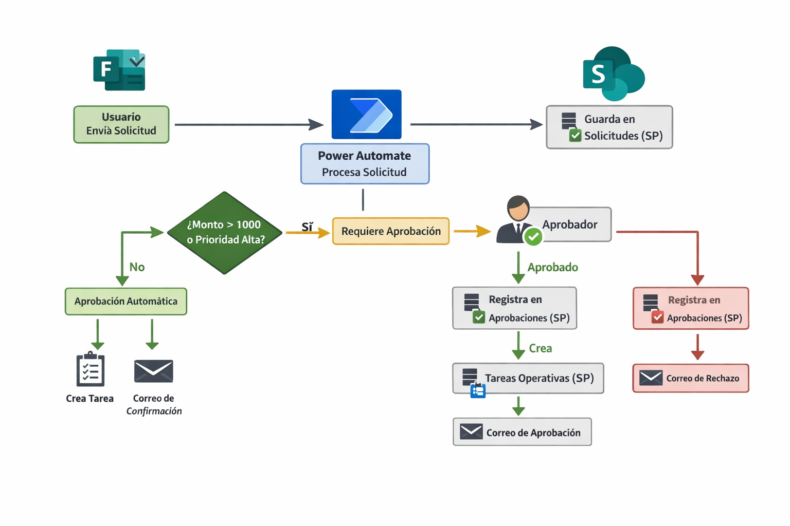
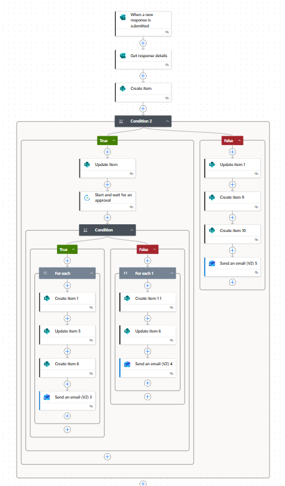
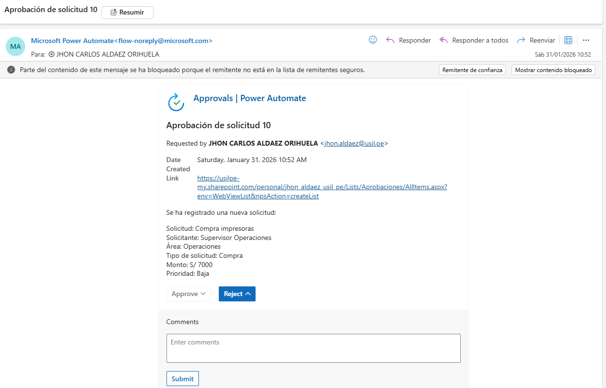

# 🚀 Sistema de Gestión y Aprobación de Solicitudes  
Automatización empresarial con **Microsoft Forms + SharePoint + Power Automate**

---

## 📌 Descripción del Proyecto

Este proyecto implementa un **sistema automatizado de gestión de solicitudes empresariales** donde los usuarios registran requerimientos mediante Microsoft Forms y el proceso completo es gestionado con Power Automate y SharePoint.

El flujo incluye:

- Registro automático de solicitudes
- Evaluación por reglas de negocio
- Proceso de aprobación
- Generación de tareas operativas
- Notificaciones automáticas por correo
- Historial completo de decisiones

Este sistema simula un escenario real de empresa para procesos como compras, accesos, soporte interno o requerimientos operativos.

---

## 🧠 Arquitectura de la Solución

Usuario → Microsoft Forms → Power Automate → SharePoint
↓
Aprobaciones
↓
Tareas Operativas

📌 El flujo decide automáticamente si una solicitud requiere aprobación según:
- Monto solicitado  
- Nivel de prioridad  

---

## ⚙️ Tecnologías Utilizadas

| Herramienta | Uso |
|------------|-----|
| **Microsoft Forms** | Captura de solicitudes |
| **Power Automate** | Automatización del proceso |
| **SharePoint Online** | Almacenamiento de datos |
| **Outlook (Office 365)** | Notificaciones por correo |

---

## 🗂 Estructura de Listas en SharePoint

### 🔹 Lista: **Solicitudes**

| Columna | Tipo |
|--------|------|
| Title | Texto |
| Solicitante | Texto |
| Área | Opción |
| TipoSolicitud | Opción |
| Monto | Moneda |
| Prioridad | Opción |
| Estado | Opción |
| FechaSolicitud | Fecha |
| Detalle | Texto |

---

### 🔹 Lista: **Aprobaciones**

| Columna | Tipo |
|--------|------|
| Title | Texto |
| SolicitudID | Número |
| Aprobador | Persona |
| Resultado | Opción |
| Comentarios | Texto |
| FechaDecision | Fecha y hora |

---

### 🔹 Lista: **Tareas Operativas**

| Columna | Tipo |
|--------|------|
| Title | Texto |
| Responsable | Persona |
| TipoGestion | Texto |
| EstadoTarea | Opción |
| RelacionSolicitud | Número |

---

## 🔄 Lógica del Flujo

### 🟢 Si requiere aprobación
1. Cambia estado a **En revisión**
2. Envía aprobación al responsable
3. Registra decisión en lista **Aprobaciones**
4. Si aprueban:
   - Estado → **Aprobado**
   - Crea tarea operativa
   - Envía correo de confirmación
5. Si rechazan:
   - Estado → **Rechazado**
   - Envía correo con comentarios

### 🔵 Si NO requiere aprobación (automático)
1. Estado → **Aprobado**
2. Se registra aprobación automática
3. Se crea tarea operativa
4. Se notifica al solicitante

---

## 📸 Evidencias del Proyecto

### 🔄 Diagrama del Flujo de Aprobación
Vista general del proceso automatizado desde el registro hasta la gestión operativa.

---

### 🗂 Registro de Solicitudes en SharePoint
Lista donde se almacenan automáticamente las solicitudes enviadas desde Microsoft Forms.

---

### 📧 Notificación por Correo de Aprobación
Ejemplo del correo que recibe el solicitante cuando su requerimiento es aprobado.

---

## 🧪 Cómo Probar el Proyecto

1. Enviar una solicitud desde Microsoft Forms
2. Revisar que se registre en SharePoint
3. Validar si entra en aprobación o aprobación automática
4. Revisar correos enviados
5. Verificar creación de tareas operativas

---

## 🚧 Mejoras Futuras

Consulta el archivo 👉 **[roadmap.md](roadmap.md)**

Próximas versiones incluirán:
- Dashboard en Power BI  
- Recordatorios automáticos  
- Escalamiento de aprobaciones  
- Integración con Microsoft Teams  

---

## 👨‍💻 Autor

**Proyecto desarrollado como práctica profesional en automatización de procesos empresariales con Power Platform.**

---

## ⭐ Valor Profesional del Proyecto

Este sistema demuestra habilidades en:

✔ Automatización de procesos  
✔ Diseño de flujos empresariales  
✔ Integración entre herramientas Microsoft  
✔ Modelado de datos en SharePoint  
✔ Gestión de aprobaciones digitales  

---

